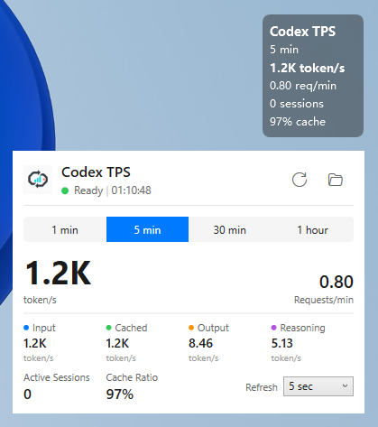

<p align="center">
  
</p>

<h1 align="center">Codex TPS for Windows</h1>

<p align="center">
  A privacy-first Windows 11 tray monitor for local Codex token throughput.<br>
  Self-contained, portable, and processed entirely on your computer.
</p>

<p align="center">
  <a href="https://github.com/lifelover26/codex-tps/releases/latest"></a>
  
  <a href="LICENSE"></a>
  
</p>

<p align="center">
  <a href="#english">English</a> | <a href="#简体中文">简体中文</a> | <a href="windows/README.md">Full Windows guide / 完整 Windows 指南</a>
</p>

<p align="center">
  
</p>

<p align="center">
  <sub>Detailed metrics panel and optional desktop overlay</sub>
</p>

> This repository is an unofficial Windows port of
> [gaofeng21cn/codex-tps](https://github.com/gaofeng21cn/codex-tps), the
> original macOS menu bar app created by Feng Gao. See
> [Origin and acknowledgements](#origin-and-acknowledgements) for details.

## English

Codex TPS for Windows reads the usage events already written to local Codex
session logs and turns them into an at-a-glance throughput display. It does not
require an API key and does not upload conversation data.

**What's new in v0.3.9:** The desktop overlay now monitors its native always-on-top state while visible. A low-frequency health check and coalesced window-position notifications restore `TOPMOST` only when the native flag is missing, addressing occasional long-running loss of topmost without repeatedly forcing Z-order.

**What's new in v0.3.8:** Shift-dragging now keeps the initial mouse-down position as the fixed origin for the entire drag gesture. Pressing, releasing, or pressing Shift again no longer re-anchors the overlay; each Shift press chooses the axis from the total displacement since drag start. Smooth threshold-based axis switching is preserved without accumulated drift.

**What's new in v0.3.7:** Fixed occasional 1px black edges on the Metrics panel at fractional DPI scales. The panel now uses pixel-aligned layout while preserving its fixed 390 DIP width.

**What's new in v0.3.6:** Shift-dragging the unlocked overlay now uses a fixed-origin, threshold-based axis lock. Holding Shift allows smooth horizontal/vertical transitions without accumulated drift; releasing Shift immediately restores free dragging.

**What's new in v0.3.5:** Right-clicking the desktop overlay while unlocked
now opens the full Overlay settings menu directly. Fixes dark-theme overlay
menu check column, submenu background, and text contrast. The tray menu and
overlay menu now share a unified light/dark theme, hover, checkmark, submenu,
and compact layout. Dynamically added WSL data source menu items also use the
unified style.

### Download

Download the latest Portable ZIP and its `.sha256` file from
[GitHub Releases](https://github.com/lifelover26/codex-tps/releases/latest).

1. Verify the ZIP checksum.
2. Extract it to a stable directory such as `%USERPROFILE%\Apps\CodexTPS`.
3. Run `CodexTPSTray.exe`.

No installer, administrator access, or separately installed .NET runtime is
required. The current build is unsigned, so Windows SmartScreen may display a
warning. Do not run the executable directly from inside the ZIP.

### Features

- Native Windows 11 notification-area application
- Detailed panel with rolling `1m`, `5m`, `30m`, and `1h` metrics
- Optional compact desktop overlay that can be dragged or locked click-through
- Overlay background opacity levels and position presets snapped to the current monitor's work area
- Single data-source selection: Windows Codex home or one discovered and accessible WSL distribution (sessions are not merged)
- Total, input, cached-input, output, and reasoning token throughput
- Requests per minute, active sessions, and cache ratio
- English and Simplified Chinese interface
- Light/dark appearance for panel, tray menus, and overlay
- Application and overlay can independently follow Windows system theme
- Configurable `5s`, `15s`, `30s`, or `60s` refresh cadence
- Manual refresh, session-folder shortcut, and optional launch at login
- Self-contained x64 Portable release

### Basic use

- Left-click the tray icon to show or hide the detailed metrics panel.
- Right-click it to change the language, theme, metric window, refresh cadence,
  login behavior, and desktop overlay settings.
- When the overlay is unlocked, drag it to move it. When locked, it becomes
  mouse click-through.

Codex records usage when a model request completes. The displayed TPS is
completion-time throughput over the selected rolling window, not a live
per-streaming-token speedometer.

### Requirements and settings

- Windows 11 x64
- Codex logs under `%USERPROFILE%\.codex\sessions`, or
  `%CODEX_HOME%\sessions` when `CODEX_HOME` is set
- WSL data sources are available only when the WSL distribution is discoverable
  and its sessions directory is accessible from Windows (for example via
  `\\wsl.localhost\Distro\...`)

Use the `Data Source` submenu to select the Windows Codex home (default) or one
discovered WSL distribution. Exactly one source is active at a time; sessions
from different sources are not merged together.

Per-user settings are stored at:

```text
%LOCALAPPDATA%\CodexTPS\settings.json
```

The executable is portable; saved preferences and the optional launch-at-login
registry entry intentionally remain outside the application directory.

### Privacy

- Session processing is local only.
- The scanner reads structural metadata and token-count records needed for
  accounting.
- Prompt, response, and tool-content bodies are not displayed, stored, or
  transmitted.
- The Windows application contains no analytics, login, telemetry, or automatic
  update path.

These values are operational estimates based on local logs, not authoritative
billing data.

### Build from source

Building requires the .NET 10 SDK. PowerShell 7 or later is also required for
release packaging.

```powershell
dotnet build .\windows\CodexTPS.slnx
dotnet test .\windows\CodexTPS.slnx
dotnet format .\windows\CodexTPS.slnx --verify-no-changes
```

See the [full Windows guide](windows/README.md) for checksum verification,
troubleshooting, removal, and release packaging.

## 简体中文

Codex TPS for Windows 是一款 Windows 11 托盘工具。它读取 Codex 已写入
本机的会话用量记录，显示不同时间窗口内的 token 吞吐率。程序本身不需要
API Key，也不会上传对话内容。

**v0.3.9 更新：** 悬浮窗显示时会持续监测原生置顶状态。程序通过低频健康检查和合并后的窗口位置变化通知，仅在原生 `TOPMOST` 标志确实丢失时恢复置顶，修复长时间使用后偶发失去置顶的问题，同时避免反复强制调整窗口层级。

**v0.3.8 更新：** Shift 拖动现在会在整个拖动手势中始终使用最初按下鼠标时的位置作为固定原点。按下、松开或再次按下 Shift 都不会重新锚定悬浮窗；每次按下 Shift 都会根据自拖动开始以来的总位移选择轴向，并保留平滑的阈值换轴手感且不会累积漂移。

**v0.3.7 更新：** 修复 Metrics 面板在特定显示器缩放或分辨率下右侧、底部偶发出现黑边的问题，并保持固定 390 DIP 宽度。

**v0.3.6 更新：** 未锁定悬浮窗时按住 Shift 拖动，会使用固定原点和阈值轴向锁定。按住 Shift 可在水平与垂直方向之间平滑切换，不会累积漂移；松开 Shift 后立即恢复自由拖动。

**v0.3.5 更新：** 解锁状态下右键桌面悬浮窗可直接打开完整 Overlay 设置菜单。
修复深色主题下悬浮窗菜单复选列、子菜单背景和文字对比度问题。托盘菜单与悬浮窗
菜单统一深浅主题、悬停、勾选、子菜单和紧凑布局。动态 WSL 数据源菜单项也使用
统一样式。

### 下载与运行

前往 [GitHub Releases](https://github.com/lifelover26/codex-tps/releases/latest)
下载最新的 Portable ZIP 和对应的 `.sha256` 文件。

1. 校验 ZIP 的 SHA-256。
2. 解压到稳定的目录，例如 `%USERPROFILE%\Apps\CodexTPS`。
3. 运行 `CodexTPSTray.exe`。

发布包解压即用，不需要安装程序、管理员权限或另行安装 .NET 运行时。当前
版本尚未进行代码签名，因此 Windows SmartScreen 可能显示警告。请勿直接在
ZIP 压缩包内运行程序。

### 主要功能

- 原生 Windows 11 通知区域应用
- 详细统计面板，支持 `1 分钟 / 5 分钟 / 30 分钟 / 1 小时` 时间窗口
- 可选桌面悬浮窗；未锁定时可拖动，锁定后鼠标可穿透
- 悬浮窗背景透明度档位与位置预设，预设位置按当前显示器工作区计算
- 数据源单选：Windows Codex Home 或一个已探测并校验可访问的 WSL 发行版（不合并会话）
- 显示总 TPS、输入、缓存输入、输出和推理输出
- 显示请求/分钟、活动会话和缓存比例
- 支持简体中文与英文即时切换
- 面板、托盘菜单和悬浮窗支持浅色/深色外观
- 应用与悬浮窗可独立跟随 Windows 系统主题
- 自动刷新可选 `5 / 15 / 30 / 60 秒`
- 支持手动刷新、打开会话目录和可选的开机启动
- 自包含 Windows x64 Portable 发布包

### 基本操作

- 左键单击托盘图标：显示或隐藏详细面板。
- 右键单击托盘图标：设置语言、主题、统计窗口、刷新频率、开机启动和悬浮窗。
- 悬浮窗未锁定时可以拖动；锁定后不会拦截鼠标操作。

Codex 会在一次模型请求完成时记录 token 用量，因此这里显示的是所选滚动
时间窗口内的完成时吞吐率，并不是逐个流式 token 的瞬时速度。

### 系统要求与设置

- Windows 11 x64
- Codex 日志位于 `%USERPROFILE%\.codex\sessions`；设置了 `CODEX_HOME`
  时则读取 `%CODEX_HOME%\sessions`
- 仅当 WSL 发行版可被探测且其 sessions 目录可从 Windows 访问时（例如通过
  `\\wsl.localhost\发行版名\...`），才会出现在数据源菜单中

通过托盘菜单的“数据源”子菜单选择 Windows Codex Home（默认）或一个已探测到
的 WSL 发行版。同一时间只有一个数据源处于活动状态，不会合并不同来源的会话。

用户设置保存在：

```text
%LOCALAPPDATA%\CodexTPS\settings.json
```

程序文件本身是绿色版；用户偏好和可选的开机启动注册表项会保留在程序目录
之外。

### 隐私说明

- 所有会话处理均在本机完成。
- 扫描器只读取统计所需的结构信息和 token 计数记录。
- 不显示、保存或传输提示词、回复正文和工具调用正文。
- Windows 版没有分析 SDK、账号登录、遥测或自动更新功能。

显示数据来自本机日志，适合观察运行状态，但不等同于官方账单数据。

校验方法、故障排查、卸载和源码构建说明请参阅
[完整 Windows 指南](windows/README.md)。

## Origin and acknowledgements

This Windows port is based on the original
[Codex TPS](https://github.com/gaofeng21cn/codex-tps) project created by
[Feng Gao](https://github.com/gaofeng21cn) as a macOS menu bar application.
Thanks to Feng Gao for the original project, product concept, interface design,
accounting semantics, and test foundation.

The Windows application reimplements the runtime and user interface in C#,
.NET 10, and WPF, with Windows-specific tray integration, a bilingual metrics
panel, an optional desktop overlay, and Portable release packaging. The original
Swift/macOS source is retained in this fork for attribution and upstream
comparison.

This is an independently maintained, unofficial community port. It is not an
official release by, affiliated with, or endorsed by the original author or
OpenAI. OpenAI and Codex are trademarks of their respective owner.

The original project's accounting semantics were informed by the public
[Tokscale](https://github.com/junhoyeo/tokscale) project; Codex TPS remains an
independent implementation and does not embed Tokscale.

## License

This repository is distributed under the [MIT License](LICENSE). The original
copyright and permission notice are retained as required by that license.
